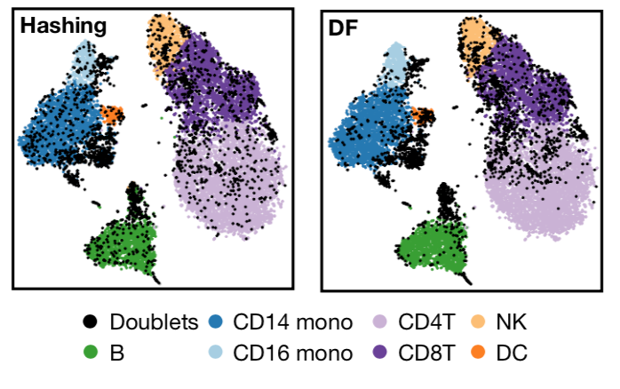
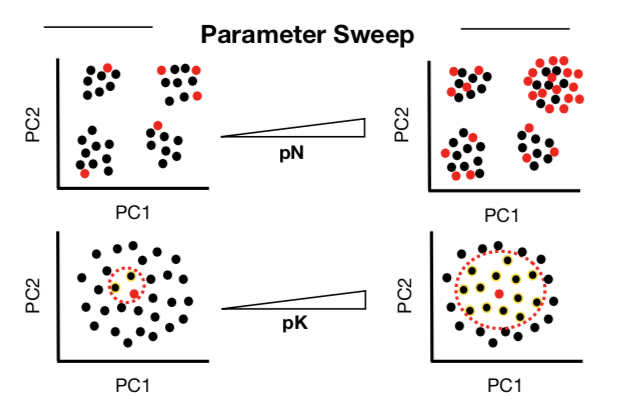
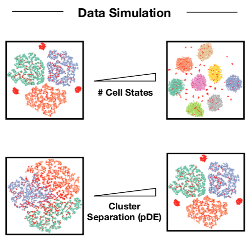

# DoubletFinder

DoubletFinder is an R package that predicts doublets in single-cell RNA sequencing data. 

DoubletFinder is implemented to interface with Seurat >= 2.0 (https://satijalab.org/seurat/) 

For more information, check out our preprint (https://www.biorxiv.org/content/early/2018/06/20/352484)

## DoubletFinder V2.0 (11/28/2018) 

New Features:
1. Increased computational efficiency during pANN computation
2. Implemented strategy for determining optimal pK values for any scRNA-seq data using pN-pK parameter sweeps and mean-variance-normalized bimodality coefficient (BCmvn)
3. Included vignette describing 'best-practices' for applying DoubletFinder to scRNA-seq data generated without sample multiplexing

## Installation (in R/RStudio)

devtools::install_github('chris-mcginnis-ucsf/doubletFinder')

## Dependencies

DoubletFinder requires the following R packages: 
Seurat (>= 2.0)
Matrix (1.2.14) 
fields (9.6) 
KernSmooth (...)
modes (...)
ROCR (1.0-7)

# DoubletFinder Overview

DoubletFinder can be broken up into 4 steps:

(1) Generate artificial doublets from existing scRNA-seq data 

(2) Pre-process merged real-artificial data

(3) Perform PCA and use the PC distance matrix to find each cell's proportion of artificial k nearest neighbors (pANN)

(4) Rank order and threshold pANN values according to the expected number of doublets

DoubletFinder takes the following arguments:

seu ~ This is a fully-processed Seurat object (i.e., after NormalizeData, FindVariableGenes, ScaleData, RunPCA, and RunTSNE have all been run).

pN ~ This defines the number of generated artificial doublets, expressed as a proportion of the merged real-artificial data. Default is set to 25%, based on observation that DoubletFinder performance is largely pN-invariant (see McGinnis, Murrow and Gartner 2018, BioRxiv).

pK ~ This defines the PC neighborhood size used to compute pANN, expressed as a proportion of the merged real-artificial data. No default is set, as pK should be adjusted for each scRNA-seq dataset. Optimal pK values should be estimated using the strategy described below.

nExp ~ This defines the pANN threshold used to make final doublet/singlet predictions. This value can best be estimated from cell loading densities into the 10X/Drop-Seq device, and adjusted according to the 

## Application to Cell Hashing and Demuxlet data

DoubletFinder successfully recapitulates ground-truth doublet classifications determined using antibody-barcode sample multiplexing (Cell Hashing) and SNP deconvolution (Demuxlet). DoubletFinder identifies false-negative Demuxlet classifications caused by doublets formed from cells with identical SNP profiles. DoubletFinder is insensitive to homotypic doublets -- i.e., doublets dervied from transcriptionally-similar cell states. 

# 'Best-Practices' for scRNA-seq data generated without sample multiplexing

## pK Selection

ROC analysis across pN-pK parameter sweeps for Cell Hashing and Demuxlet datasets demonstrate that DoubletFinder performance is largely invariant of pN value selection:

ROC analysis across pN-pK parameter sweeps for simulated scRNA-seq data with (I) Variable numbers of cell states and (II) Variable magnitudes of transcriptional heterogeneity demonstrates that (I) Optimal pK value selection depends on the total number of cell states and (II) DoubletFinder performance suffers when applied to transcriptionally-homogenous data. Simulated data was generated using a strategy similar to as described in Wolock, Lopex & Klein, 2018.

Simulated and sample-multiplexed data are unique in that ground-truth doublet classifications can be leveraged to characterize how DoubletFinder parameters must be 'fit' to distinct scRNA-seq datasets. However, doublets remain unknown in real-world contexts -- which is likely why you are interested in DoubletFinder, at all!

To maximize the accuracy of DoubletFinder predictions, we sought a ground-truth-agnostic metric that coincides with pK values that maximize AUC in Cell Hashing and Demuxlet data. Mean-variance normalized bimodality coefficient (BCmvn) achieves this goal, featuring a single, easily-discernible maximum at pK values that optimize AUC. 

BCmvn distributions also feature a single maximum for scRNA-seq datasets generated without sample-multiplexing (e.g., Mouse pancreas, Byrnes et al., 2018, Nature Communcations; Mouse kidney, Park et al., 2018, Science), enabling pK selection.

## Doublet Number Estimation

DoubletFinder is sensitive to heterotypic doublets -- i.e., doublets formed from transcriptionally-distinct cell states -- but is insensitive to homotypic doublets -- i.e., doublets formed from transcriptionally-similar cell states. In our original manuscript, we suggested using DoubletFinder to predict 'n' doublets, where 'n' is the number of doublets expected according to Poisson statistical estimates from the cell loading density. However, Poisson estimates are agnostic of gene expression state, and will thus invariably overestimate the number of detectable doublets.

To address this issue, we suggest users utilize literature-supported cell type annotations to model the proportion of homotypic doublets present in their data. As an example, we present an analysis of mouse kidney scRNA-seq data (Park et al., 2018, Science)

## References

1.	Stoeckius M, Zheng S, Houck-Loomis B, Hao S, Yeung BZ, Smibert P, Satija R. Cell "hashing" with barcoded antibodies enables multiplexing and doublet detection for single cell genomics. 2017. Preprint. bioRxiv doi: 10.1101/237693.

2.  Kang HM, Subramaniam M, Targ S, Nguyen M, Maliskova L, McCarthy E, Wan E, Wong S, Byrnes L, Lanata CM, Gate RE, Mostafavi S, Marson A, Zaitlen N, Criswell LA, Ye JC. Multiplexed droplet single-cell RNA-sequencing using natural genetic variation. Nat Biotechnol. 2018; 36(1):89-94. 

3.  Wolock SL, Lopez R, Klein AM. Scrublet: computational identification of cell doublets in single-cell transcriptomic data. bioRxiv doi: 10.1101/357368.

4.  Park J, Shrestha R, Qiu C, Kondo A, Huang S, Werth M, Li M, Barasch J, Suszták K. Single-cell transcriptomics of the mouse kidney reveals potential cellular targets of kidney disease. Science. 2018; 360(6390):758-63.

5.  Byrnes LE, Wong DM, Subramaniam M, Meyer NP, Gilchrist CL, Knox SM, Tward AD, Ye CJ, Sneddon JB. Lineage dynamics of murine pancreatic development at single-cell resolution. Nat Commun. 2018; 9:3922.

